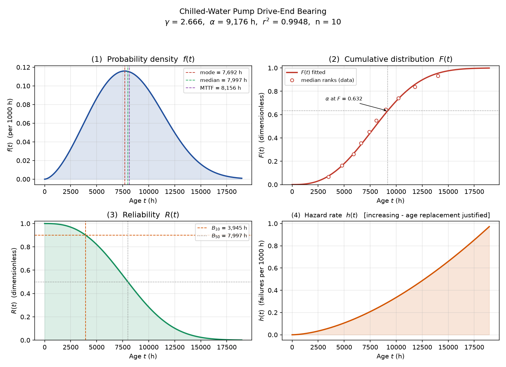

# reliability-toolkit

Python tools for maintenance and reliability engineering analysis.

Built while preparing for SMRP CMRP certification, with each module
implementing methods from the SMRP Body of Knowledge. Intended as a
working tool rather than a study aid.



## Installation

```bash
git clone https://github.com/Dodecahedron-BD/reliability-toolkit.git
cd reliability-toolkit
python -m venv .venv
source .venv/Scripts/activate      # Linux/macOS: .venv/bin/activate
pip install -e ".[plot,dev]"
```

## Usage

```python
from reliability_toolkit.reliability import fit_mrr, report
from reliability_toolkit.plotting.weibull_plot import analyse

bearing = [3500, 4800, 5900, 6600, 7400, 8100, 9000, 10200, 11800, 14000]

gamma, alpha, r, _, _ = fit_mrr(bearing)
print(f"shape = {gamma:.3f}, characteristic life = {alpha:,.0f} h")

res = analyse(bearing, title="Pump Drive-End Bearing")
```

Right-censored data is handled by passing suspensions as a second list:

```python
failures    = [1100, 1850, 2400, 2950, 3600, 4300, 5100]
suspensions = [2200, 3000, 4000, 5500, 5500]
analyse(failures, suspensions, title="Cam Follower")
```

## Modules

| Module | Status | Contents |
|---|---|---|
| `reliability.weibull` | available | Two-parameter Weibull fitting by median-rank regression (RRX) with Johnson rank adjustment for censored data, plus MLE cross-check. Distribution functions, B-lives, closed-form life statistics. |
| `reliability.weibull_report` | available | Formatted parameter table with interpretation of the shape parameter. |
| `plotting.weibull_plot` | available | Four-panel figure: pdf, cdf, reliability, hazard rate. |
| `economics` | planned | NPV, IRR, equivalent annual cost, life-cycle cost, cost of unreliability. |
| `reliability.metrics` | planned | MTBF, MTTR, MTBM, MDT, availability, FPMH. |
| `reliability.intervals` | planned | Optimal PM interval, P–F interval, failure-finding interval. |
| `reliability.criticality` | planned | FMECA scoring and asset criticality ranking. |

## Method notes

Notation follows the NIST/SEMATECH e-Handbook, section 8.1.6.2: `gamma`
is the shape parameter, `alpha` the scale parameter or characteristic
life, and the location parameter is held at zero.

Median-rank regression defaults to RRX (x regressed on y), the
reliability-engineering convention, on the basis that measurement
scatter lies in the recorded times rather than in the plotting
positions. Least squares is not symmetric in its two variables, so RRX
and RRY give different estimates from the same data.

Life data is in hours throughout.

## Tests

```bash
pytest -q
```

Seven tests covering exact parameter recovery on synthetic data
constructed at Bernard ranks, MLE agreement, the exponential special
case, the 63.2% characteristic-life point, and censoring behaviour.

## Licence

MIT